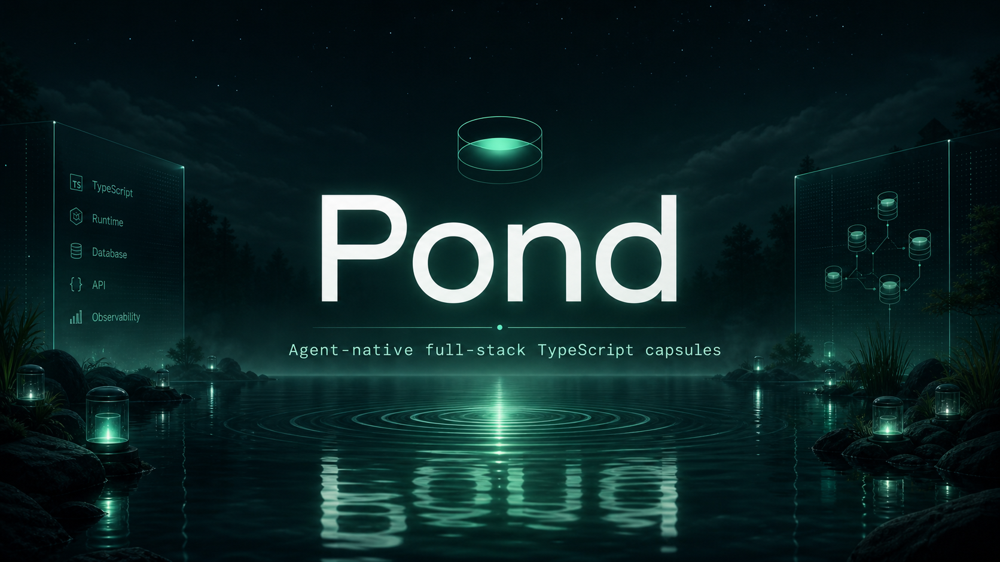
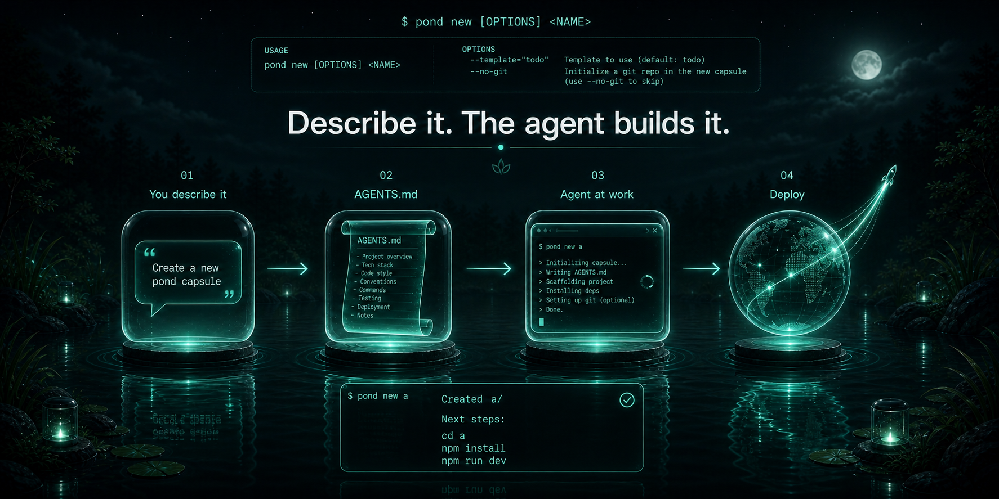
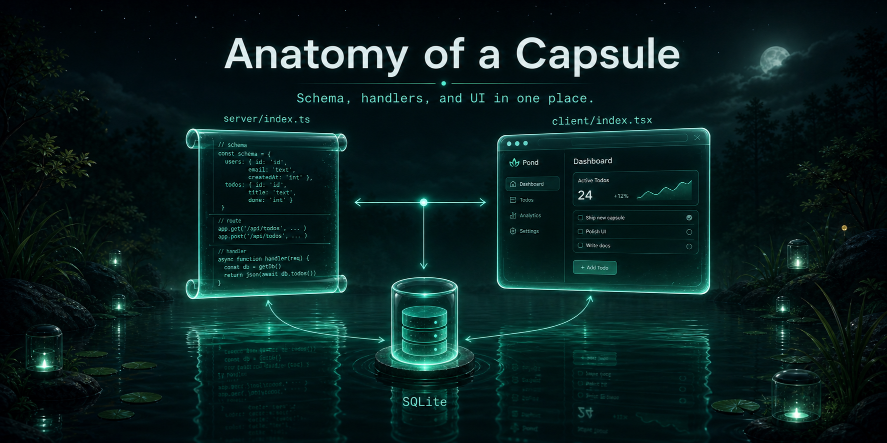
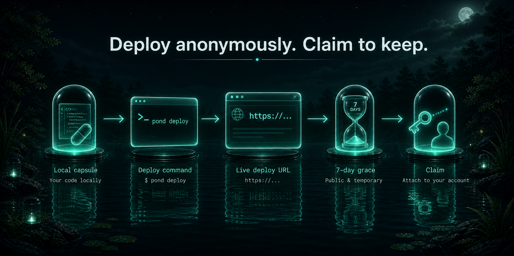
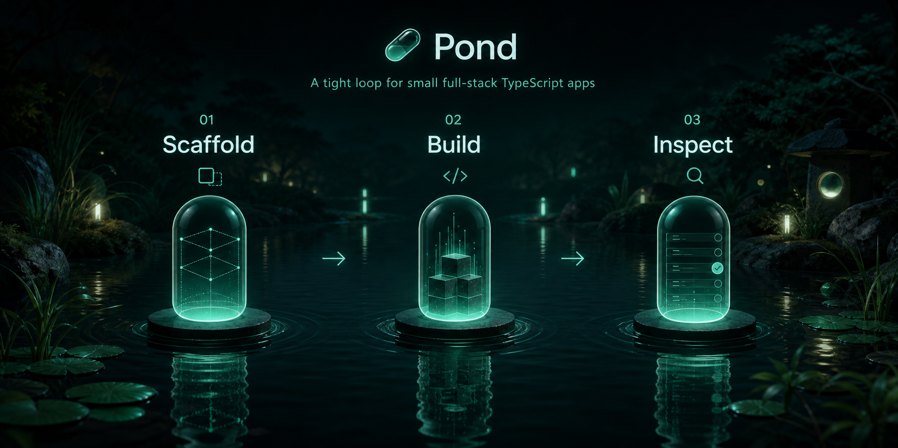
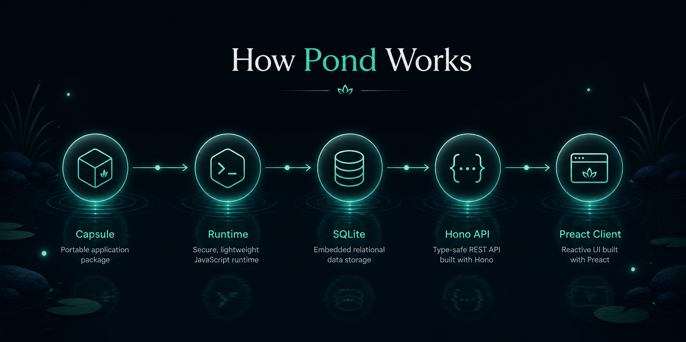
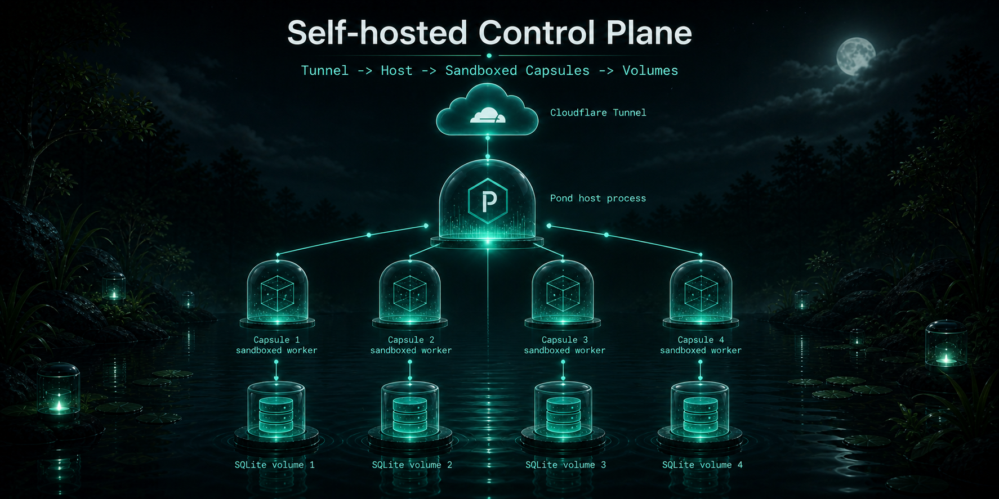

# Pond

<p align="center">
  
</p>

<p align="center">
  
</p>

<p align="center">
  <strong>Agent-native full-stack TypeScript capsules.</strong><br />
  Scaffold a small app, define your schema and handlers in one file, and run it locally with a built-in Hono + SQLite runtime.
</p>

<p align="center">
  
  
  
  
</p>

Pond is an open-source, agent-native CLI and runtime for building small full-stack TypeScript apps called capsules. It is designed around a tight inner loop:

1. `pond new` scaffolds a capsule.
2. You define schema, queries, mutations, and endpoints in `server/index.ts`.
3. `pond dev` compiles the capsule, provisions SQLite automatically, bundles the client, and serves the app.

The current runtime is optimized for local development and alpha workflows: fast scaffolding, zero-config SQLite, simple auth, live reload, and inspection endpoints that make capsules easy to reason about.

## Why Pond

- Single-file server model. Schema, queries, mutations, and endpoints live together in the capsule definition.
- Built-in local runtime. Pond compiles the server with esbuild, mounts routes on Hono, and auto-creates SQLite tables.
- No manual client plumbing. Preact hooks talk to generated query and mutation routes directly.
- Agent-friendly workflow. The CLI is small, inspectable, and easy for coding agents to scaffold against. `pond new a dashboard for X` writes an `AGENTS.md` that the agent reads on first open.
- Real dev ergonomics. Live reload, guest identity switching, DB inspection, logs, and a deploy bundle path are already built in.
- Browser-based IDE for hosted capsules. After `pond deploy --api …`, open the returned `/ide/<id>` URL to edit `server/`, `client/`, and `shared/` files, see build diagnostics, and preview the live capsule without leaving the page.

## What A Capsule Looks Like

```ts
import { capsule, mutation, query, string, table } from "pond/server"

export default capsule({
  schema: {
    messages: table({
      body: string(),
    }),
  },

  queries: {
    messages: query((ctx) => ctx.db.messages.orderBy("createdAt", "desc").all()),
  },

  mutations: {
    sendMessage: mutation((ctx, body: string) => ctx.db.messages.insert({ body })),
  },
})
```

<p align="center">
  
</p>

That one definition becomes:

- a SQLite-backed `messages` table
- `GET /api/query/messages`
- `POST /api/mutation/sendMessage`
- a typed server runtime context with `db`, `auth`, `env`, and `log`

## Quickstart

```bash
npm install -g pondsh
pond new my-capsule
cd my-capsule
pond dev
```

Open `http://localhost:3000`.

### Or: describe what you want and let an agent build it

Anything you type after `pond new` that isn't a single slug is treated as a build prompt:

```bash
pond new a dashboard for hermes-agent
# → creates ./dashboard-hermes-agent/
# → writes AGENTS.md + .claude/CLAUDE.md with your prompt + the capsule contract
# → open in Claude Code / Cursor; the agent reads the brief and edits server/ + client/
```

Pass `--dir my-app` to override the auto-slugged directory name. Pond itself doesn't call any LLM — the scaffolded files just hand the brief to whatever agent you open the capsule in. After the agent finishes, `npm run dev` and `pond deploy --api …` work normally; the IDE URL lets you keep iterating in the browser.

### Anonymous hosted deploy (Lakebed-style)

If a public Pond host is running (e.g. `pond.example.com`), you can ship anonymously without an account:

<p align="center">
  
</p>

```bash
pond deploy --api https://pond.example.com
# → returns a URL like https://abc123def4567890.pond.example.com
# → prints an IDE URL: https://pond.example.com/ide/abc123…#token=<claim>
# → returns a one-time claim token saved to .pond/deploy.json
```

The deploy lives for 7 days. Claim it to keep it:

```bash
pond claim --signup <username>
```

### Self-host the control plane

See [`docs/operations.md`](./docs/operations.md) for the full Lakebed-style launch runbook (Oracle Always Free + Cloudflare Tunnel + Cloudflare DNS, ~$10/yr total). Deploy files in [`deploy/`](./deploy/).

## Developer Loop

```bash
pond new chat-demo
cd chat-demo
npm install
pond dev
```

Pond will:

- scaffold `server/index.ts`, `client/index.tsx`, `shared/`, and `.env.pond.server`
- scaffold a capsule `package.json` with local `pond` scripts
- initialize a git repository by default
- compile the capsule server with esbuild
- create `.pond/data.db`
- create tables from the capsule schema
- bundle the Preact client and serve an HTML shell
- watch `server/index.ts`, `client/index.tsx`, and `.env.pond.server`
- push reload events over `/__pond_reload`

<p align="center">
  
</p>

## CLI

| Command                                    | Purpose                                                                  |
| ------------------------------------------ | ------------------------------------------------------------------------ |
| `pond new <name>`                          | Scaffold a new capsule from a template                                   |
| `pond new <free-form description...>`      | Scaffold + write `AGENTS.md` so an agent can build the described capsule |
| `pond dev --port 3000`                     | Run the local dev server                                                 |
| `pond deploy`                              | Build a standalone server bundle and write deploy metadata               |
| `pond deploy --api http://localhost:8787`  | Upload a hosted deploy to a Pond control plane                           |
| `pond claim`                               | Cross-machine claim using a deploy's claim token                         |
| `pond start`                               | Start the bundled deploy artifact locally                                |
| `pond host`                                | Start the self-hosted Pond control plane                                 |
| `pond inspect`                             | Inspect local capsule metadata                                           |
| `pond logs`                                | Stream structured local logs                                             |
| `pond db list`                             | List SQLite tables from a running capsule                                |
| `pond db dump [table]`                     | Dump one table or the full local database                                |
| `pond auth as <name>`                      | Set the current dev guest identity                                       |
| `pond login --api <url> --username <name>` | Bootstrap first admin (needs `POND_HOST_TOKEN`) or attach with `--token` |
| `pond user create <name> [--admin]`        | Create a new control-plane user (admin only)                             |
| `pond env list/set/unset <deployId>`       | Manage hosted-deploy server env vars                                     |
| `pond domains list/add/remove <subdomain>` | Manage custom subdomain aliases for a deploy                             |
| `pond token rotate --api <url>`            | Rotate the saved user API token                                          |

## Runtime Model

<p align="center">
  
</p>

At runtime, Pond does four things:

1. Bundles `server/index.ts` into a temporary ESM module.
2. Imports the capsule definition and creates SQLite tables from `schema`.
3. Resolves auth per request from the session cookie, falling back to a guest user when no session exists.
4. Mounts generated routes and any custom endpoints onto a Hono server.

The client runtime exposes:

- `useQuery<T>(name)`
- `useMutation<TArgs, TResult>(name)`
- `useAuth()`
- `SignInWithGoogle`
- `signOut()`

## For coding agents

If you are a coding agent reading this and the user just asked you to build a pond capsule, fetch one of these and follow it:

- `https://pond.run/llms.txt` — the agent docs index (small)
- `https://pond.run/llms-full.txt` — full server + client reference in one fetch (~15 KB)
- `https://pond.run/docs/api-reference.md` — server (`pond/server`)
- `https://pond.run/docs/client-reference.md` — client (`pond/client`)

Hard rules for a pond capsule:

- `server/index.ts` imports only from `pond/server`, plain relative TypeScript, and Node built-ins. No arbitrary npm packages.
- `client/index.tsx` imports only from `pond/client`. Preact + Tailwind classes; do not bring in React, react-router, react-query, etc.
- Every `server/index.ts` ends with `export default capsule({ ... })`.
- Every `client/index.tsx` exports a component named `App`.
- Authorization is your responsibility inside handlers (filter by `ctx.auth.userId`; re-check ownership on update / delete).
- Do not delete `server/index.ts` or `package.json`. They are required.

When you scaffold a capsule via `pond new "<description>"`, the CLI writes an `AGENTS.md` + `.claude/CLAUDE.md` that already point at these URLs.

## Authentication

Pond supports guest mode and Google OAuth in the local runtime.

Built-in auth routes:

- `GET /auth/google`
- `GET /auth/google/callback`
- `GET /auth/me`
- `POST /auth/signout`

Users are persisted to `_pond_users`. If no session cookie is present, the request is treated as a guest request and still has access to the capsule unless your own handlers restrict it.

Environment variables live in `.env.pond.server`:

```bash
GOOGLE_CLIENT_ID=
GOOGLE_CLIENT_SECRET=
GOOGLE_REDIRECT_URI=http://localhost:3000/auth/google/callback
```

If `GOOGLE_REDIRECT_URI` is omitted, Pond defaults it to the current dev port.

## Inspection And Debugging

When running locally, Pond exposes internal inspection endpoints:

- `GET /__pond/db/tables`
- `GET /__pond/db/dump/:table`
- `GET /__pond/logs`
- `GET /__pond/inspect`
- `POST /__pond/auth/guest`

These power the CLI inspection commands and make local capsules easy to inspect without wiring separate admin tooling.

## Deploy Bundles

`pond deploy` has two modes, depending on whether `--api <url>` is passed:

**Local (no `--api`).** Bundles the capsule server to `.pond/deploy-bundle.mjs`, writes `.pond/deploy.json` with a generated deploy ID + bundle hash. Use `pond start` to serve the bundle.

**Hosted (`--api <url>`).** Uploads the source tree (`server/`, `client/`, `shared/`, `package.json`) to the control plane. The host runs esbuild server-side, stores both the source and the produced bundle, forks a worker, and returns the deploy URL + claim token + IDE URL. The on-server source is what backs the browser IDE — edits made in the IDE go through `/api/deploys/:id/files/*` and trigger a server-side rebuild on Deploy.

## Hosted control plane (self-hosted MVP)

Pond ships a self-hostable control plane that fronts multiple capsule deploys behind a single ingress, manages user accounts and per-deploy ownership, and isolates each deploy in its own forked worker process.

<p align="center">
  
</p>

### Threat model

The hosted control plane is intended for **trusted deployers** (you and your team). Isolation between deploys is V8-level (one Node child process per deploy) — not OS-level. Sibling deploys run under the same UID and can read each other's files. Do **not** host untrusted third-party code on a single pond host yet.

### Bootstrap quickstart

```bash
# 1. Start the control plane (binds 127.0.0.1:8787 by default)
pond host --port 8787

# 2. Note the bootstrap token printed in the log, then create the first admin
POND_HOST_TOKEN=<that-token> pond login --api http://localhost:8787 --username admin

# 3. Deploy a capsule from any project directory
pond deploy --api http://localhost:8787
```

### Multi-user

```bash
# As admin, mint a token for bob
pond user create bob --api http://localhost:8787

# On bob's machine, attach to that account
pond login --api http://localhost:8787 --token <bob-token> --username bob
```

Each deploy is owned by the user that created it. Admins can manage any deploy. The legacy claim token in `.pond/deploy.json` still works for cross-machine ownership transfer via `pond claim`.

### Anonymous deploys (Lakebed-style)

`pond deploy --api <url>` without saved credentials creates a hosted deploy with no account attached. The control plane returns a URL and a claim token (saved to `.pond/deploy.json`). Claim it later by running either:

```bash
pond claim --signup <username>          # create a new account on the host
# or
pond login --api <url> --username <name>
pond claim                              # attach to your existing account
```

**Two-phase TTL.** An unclaimed anonymous deploy goes through two cleanup phases:

- **Grace** (`POND_ANONYMOUS_CLEANUP_GRACE`, default `1h`, also `--anonymous-grace`) — after this, the worker is terminated. The disk contents are kept, the deploy id stays valid, and claiming it (with `pond claim`) re-forks the worker.
- **Retention** (`POND_ANONYMOUS_CLEANUP_RETENTION`, default `7d`, also `--anonymous-retention`) — after this, the deploy directory and all its data are deleted.

The sweeper runs every 60s and at host startup.

**Rate limit.** Anonymous `POST /api/deploys` is limited to 5 per IP per rolling hour (`--anonymous-rate-per-hour`). The window is persisted in the control DB, so the limit survives a host restart. Disable anonymous deploys entirely with `--anonymous-deploys=false`. If the host runs behind a reverse proxy, set `POND_TRUST_PROXY_HEADERS=1` (or `--trust-proxy`) so the rate limit keys on `x-forwarded-for` rather than the proxy's address.

**Anonymous quotas (smaller than the defaults).**

| Field            | Default | Anonymous |
| ---------------- | ------- | --------- |
| `maxBundleBytes` | 64 MB   | 16 MB     |
| `maxDiskBytes`   | 512 MB  | 128 MB    |
| `maxMemoryMb`    | 256     | 128       |

**Sandbox (Node 22+).** Anonymous workers are spawned with Node's experimental permission model:

- `--experimental-permission`
- `--allow-fs-read=<deploy dir>` + `--allow-fs-read=<pond src dir>` + `--allow-fs-read=<pond node_modules>`
- `--allow-fs-write=<deploy dir>`
- `--allow-addons` (required so better-sqlite3 can load — Node warns about this)

In addition, three things are patched at boot to block outbound network: `globalThis.fetch`, best-effort `undici.fetch`, and `net.Socket.prototype.connect` (which closes `node:http`, `node:https`, and `tls.connect`, all of which go through `net.Socket`). All four throw `Outbound network access disabled for anonymous deploys`. This is **defense-in-depth, not an airtight sandbox** — a capsule that ships a native module could bypass the JS-layer patch entirely, and `dns.lookup` still resolves names. The point is to make the common case (an anonymous deploy that calls out to the internet) fail loudly. For real network isolation, run the host behind an outbound-blocking firewall (iptables/pf). Authenticated deploys are NOT subject to the permission model or the network shims. On Node < 22, the permission model is disabled (host logs a warning at startup) but the network shims still apply.

**What anonymous deploys cannot do:**

- `PUT /api/deploys/:id` — must claim before updating the bundle.
- `PUT /api/deploys/:id/env` — env upload is blocked at the API level. `pond deploy --push-env` errors out without uploading.
- Outbound `fetch` from inside the capsule (see above).

### Browser IDE

Every hosted deploy ships with a browser-based IDE at `<api>/ide/<deployId>`. After `pond deploy --api …`, the CLI prints the URL (with a one-time `#token=` fragment for anonymous deploys). Open it in a browser and you get:

- A file tree over `server/`, `client/`, `shared/`, `package.json`.
- A multi-tab CodeMirror editor (TypeScript / TSX / JSON / Markdown).
- An outline of tables, queries, and mutations parsed from `server/index.ts`.
- A live preview iframe of the deploy.
- A **Deploy** button that saves all dirty files, re-runs esbuild server-side, hot-swaps the worker, and refreshes the preview. esbuild diagnostics render with file / line / column in the right pane.

The IDE is a single inlined HTML SPA (~192 KB gzipped) served on the bare host. It talks to the standard control-plane endpoints — no extra deploy surface, same auth (claim token or owner Bearer). Anonymous deploys must be claimed before editing.

Files under `server/`, `client/`, `shared/`, plus `package.json` are addressable. `.env.pond.server` is **not** exposed through the IDE — edit secrets via `pond env` instead.

### Env management

```bash
pond env list <deployId> --api http://localhost:8787
pond env set <deployId> KEY=value --api http://localhost:8787
pond env unset <deployId> KEY --api http://localhost:8787
```

Updating env triggers a worker re-fork so the new values take effect immediately.

### Token rotation

```bash
# User-side: rotate your own API token
pond token rotate --api http://localhost:8787

# Per-deploy: rotate the claim token (owner or admin)
curl -X POST -H "Authorization: Bearer <token>" \
  http://localhost:8787/api/deploys/<deployId>/rotate-claim-token
```

When a user API token is rotated, the previous token continues to authenticate for a 5-minute grace window. This lets in-flight clients (CI runners, long-lived agents) switch to the new token without an outage. The grace window applies only to the immediately prior token — repeated rotations within 5 minutes invalidate intermediate tokens.

### Quotas

Every deploy has a quota, enforced by the control plane:

| Field            | Default | Enforcement                                               |
| ---------------- | ------- | --------------------------------------------------------- |
| `maxBundleBytes` | 64 MB   | POST/PUT bundles larger than this return 413              |
| `maxDiskBytes`   | 512 MB  | post-write directory size check on bundle and env updates |
| `maxMemoryMb`    | 256     | passed to the worker via `--max-old-space-size`           |

Env writes have separate caps not exposed as quotas: `envText` is limited to 64 KB total, 256 entries, 1024 chars per value. Oversize uploads return 413 before the file is written.

Admins can override per deploy:

```bash
curl -X PUT -H "Authorization: Bearer <admin-token>" \
  -H "content-type: application/json" \
  -d '{"maxMemoryMb": 512}' \
  http://localhost:8787/api/deploys/<deployId>/quota
```

Changing `maxMemoryMb` triggers a worker re-fork. There is no CLI subcommand for quotas yet — use `curl`.

### Ingress & CORS

The control plane routes requests by subdomain (`<deployId>.<publicHost>:<port>`) to the matching forked worker. Same-origin CORS is enforced at both the control plane and the deploy worker: cross-origin browser requests receive **no** `Access-Control-Allow-Origin` header by default. A capsule can opt extra origins in by exporting `allowedOrigins: string[]` from `capsule({ ... })`.

### Custom subdomains

Every deploy is always reachable at its hex-id subdomain (`<deployId>.<publicHost>`). Owners can register friendly aliases:

```bash
pond domains add my-app                  # uses deployId from .pond/deploy.json
pond domains add my-app <deployId>       # explicit
pond domains list
pond domains remove my-app
```

After `add` the deploy is reachable at both `<deployId>.<publicHost>:<port>` and `my-app.<publicHost>:<port>`.

Subdomain rules:

- DNS label: lowercase `a-z`, digits, hyphens, max 63 chars, no leading or trailing hyphen.
- Reserved names: `api`, `admin`, `docs`, `www`, `app`, `health`.
- Names that look like hex deployIds (`/^[a-f0-9]{8,}$/`) are not allowed.

Deleting a deploy cascades and removes all its custom domains.

**Going to production** requires a wildcard DNS record `*.pond.example.com → <your-pond-host>` plus TLS handled outside of pond. Pond does not provision certificates. A minimal Caddyfile that terminates TLS for the wildcard and reverse-proxies to a local pond host:

```caddy
*.pond.example.com {
  tls you@example.com
  reverse_proxy 127.0.0.1:8787
}
```

Cloudflare Tunnel works the same way: point a wildcard hostname at the pond port.

### Audit log

The control plane records mutations (deploy create/update/delete/claim, env writes, quota changes, domain add/remove, user create, token rotate) in an append-only `audit_log` table. Admins can read recent entries:

```bash
curl -H "Authorization: Bearer <admin-token>" \
  http://localhost:8787/api/audit?limit=100
```

Each entry has `ts`, `actor` (user id, `__host__`, `__anonymous__`, or `__claim_token__`), `action`, `targetDeployId`, `targetUserId`, and a free-form `metadata` object. There is no CLI subcommand yet — use `curl`.

### Persistent logs

Each deploy's `ctx.log.*` entries stream over SSE on `/__pond/logs` and are appended as NDJSON to `<deploy-dir>/.pond/logs.ndjson`. The file rotates at 5 MB (one prior generation kept as `logs.ndjson.1`). On restart, the most recent 200 entries are restored.

### What is NOT solved yet

- No OS-level isolation between deploys (no containers, no seccomp).
- No HTTPS, no automatic TLS, no DNS provisioning, no wildcard cert automation (custom subdomains require an external reverse proxy for TLS).
- No billing, no usage metering beyond hard quota limits.
- No WebSocket support through the proxy.

## Public Server API

Pond currently exports these server-side primitives from `pond/server`:

- `capsule()`
- `table()`
- `string()`
- `number()`
- `boolean()`
- `query()`
- `mutation()`
- `endpoint()`
- `json()`
- `text()`

The request context exposes:

- `ctx.db`
- `ctx.auth`
- `ctx.env`
- `ctx.log`

## Project Status

Pond is in alpha. The current codebase is strongest at:

- local development
- small SQLite-backed apps
- generated query and mutation routes
- simple auth flows
- agent-friendly scaffolding

Still early:

- deployment is bundle-first, not platform-native
- there is no first-class hosted control plane yet
- the default template is intentionally small

## Repository Layout

```text
src/
  cli.ts
  commands/
  runtime.ts
  dev-server.ts
  bundler.ts
  server/
client/
  index.ts
bin/
  pond.js
docs/
  branding/
```

## Branding

The current visual direction is intentionally simple:

- dark water palette
- bright signal greens for active runtime energy
- capsule and ripple geometry instead of generic SaaS gradients
- diagrams that explain the mental model instead of decorative filler

Brand assets live in [`docs/branding`](./docs/branding).

## Contributing

See [`CONTRIBUTING.md`](./CONTRIBUTING.md) for local setup, the dev loop, and the PR checklist. API references: [`docs/api-reference.md`](./docs/api-reference.md) (server) and [`docs/client-reference.md`](./docs/client-reference.md) (client).

## License

MIT — see [`LICENSE`](./LICENSE).
